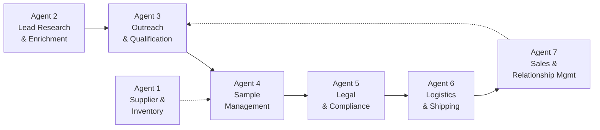

# Agent Responsibilities

## Overview

Seven agents, each with a single responsibility. Agents communicate via the
EventBus and share state through the StateManager — they never call each
other directly.



## Agent 1 — Supplier & Inventory

| | |
|---|---|
| **Owns** | Lot inventory, EUDR data packs, stock levels |
| **Trigger** | Confirmation requests from Agent 4 |
| **KPIs** | Inventory freshness (≤24h), confirmation SLA (≤1 business day), EUDR completeness (100%) |
| **Never does** | Outreach, sample dispatch, contract negotiation |
| **Hands off to** | Agent 4 (lot confirmation + docs) |

**Key methods called on StateManager:**
- `add_lot()`, `update_lot()`, `list_lots()`
- `confirm_lot_for_sample()` — validates stock, crop year, EUDR for EU buyers
- `find_substitute()` — same region + process + score ±1.0
- `flag_lot_for_qa()`, `release_lot_from_qa()`
- `log_feedback()` — auto-flags QA on ≥2 critical-keyword rejections

---

## Agent 2 — Lead Research & Enrichment

| | |
|---|---|
| **Owns** | Lead data quality, segmentation, VP recommendation |
| **Trigger** | Operator provides raw lead list (CSV or API) |
| **Input** | Raw company data (name, website, headquarters, contacts) |
| **Output** | Enriched lead with: segment, VP, priority tier, language, sequence type |
| **KPIs** | Packet completeness (100%), VP accuracy (≥85%), disqualification discipline (≥5%) |
| **Never does** | Outreach, sample dispatch, live qualification (Q4/Q5 always "Unknown — confirm live") |
| **Hands off to** | Agent 3 (lead in ENRICHED state) |

**Key methods called on StateManager:**
- `create_lead()` — assigns lead_id, dedup by company+country
- `update_lead_state()` → ENRICHED
- `set_lead_field()` — priority_tier, recommended_vp, outreach_language
- `add_tag()` — fairtrade, organic, microlot, eudr-aware
- `transfer_ownership(A2 → A3)`

---

## Agent 3 — Outreach & Qualification

| | |
|---|---|
| **Owns** | Outreach sequences (LinkedIn + email), QUAL gate enforcement |
| **Trigger** | Lead enters ENRICHED state (owned by Agent 3) |
| **Input** | Enriched lead packet from Agent 2 |
| **Output** | Qualified lead (Q1–Q5 confirmed) or nurtured/ghosted lead |
| **KPIs** | Qualified conversations/week (≥3/AE), sample budget discipline (≤3 full sets/week) |
| **Never does** | Sample dispatch, contract negotiation, price quoting in cold outreach |
| **Hands off to** | Agent 4 (QUALIFIED lead), or back to self (NURTURE) |

**Channel strategy:** LinkedIn-first for specialty/mid-tier importers; email-first for large commercial importers (Volcafe, ECOM, Olam, Sucafina) or leads with no LinkedIn.

**QUAL gate (all 5 must be confirmed in writing):**
1. Volume band (≥1 FCL/year of Ethiopian or comparable East African origin)
2. Segment fit (importer, trader, or roaster buying ≥25 bags/lot)
3. Authority (buyer, head of coffee, sourcing lead, or founder)
4. Timing (sourcing in next 1–6 months)
5. Sample policy (agrees to pay shipping or accept pre-paid against interest)

---

## Agent 4 — Sample Management

| | |
|---|---|
| **Owns** | Sample lifecycle (9 responsibilities, see below) |
| **Trigger** | Lead enters QUALIFIED state |
| **Input** | Qualified lead packet + target profile from Agent 3 |
| **Output** | Approved / Rejected / Needs-another-sample decision per lot |
| **KPIs** | Cycle time (≤14 business days), decision capture rate (≥85%), lot-match accuracy (≥80%) |
| **Never does** | Contract negotiation, freight booking, outreach |
| **Hands off to** | Agent 5 (Approved), Agent 1 (rejection feedback), Agent 3 (VP mismatch signal) |

**9 responsibilities:**
1. Receive qualified buyer
2. Recommend which lot fits (9-step filter algorithm)
3. Request approval (operator + Agent 1)
4. Generate sample request record
5. Print labels
6. Track shipments
7. Remind buyers (Day +7, +10, +14, +18 cadence)
8. Collect cupping scores
9. Decide: Approved / Rejected / Needs another sample

**Sample types:**
- Type A (350g) — pre-shipment, default
- Type B (200g) — forward-program representative (26/27 crop)
- Type C (500g) — post-contract shipment sample
- Fallback 150g — for buyers who refuse volume disclosure

---

## Agent 5 — Legal & Compliance

| | |
|---|---|
| **Owns** | Contract execution, ICC terms, EUDR compliance documentation |
| **Trigger** | Lead enters DECIDED_APPROVED state |
| **Input** | Approved sample + buyer's target contract terms |
| **Output** | Signed contract, compliance documentation |
| **KPIs** | Contract turnaround (≤5 business days), compliance audit pass rate (100%) |
| **Never does** | Lead research, sample dispatch, logistics booking |

---

## Agent 6 — Logistics & Shipping

| | |
|---|---|
| **Owns** | Freight booking, customs documentation, vessel scheduling |
| **Trigger** | Contract signed (Agent 5 completes) |
| **Input** | Signed contract + shipment details |
| **Output** | Booked shipment, customs cleared, delivered |
| **KPIs** | On-time shipment (≥95%), customs hold rate (≤5%), documentation accuracy (100%) |
| **Never does** | Contract negotiation, sample dispatch, lead research |

---

## Agent 7 — Sales & Relationship Management

| | |
|---|---|
| **Owns** | Long-term buyer relationships, repeat orders, account growth |
| **Trigger** | Contract completed (Agent 6 delivers) |
| **Input** | Delivery confirmation + buyer feedback |
| **Output** | Repeat orders, referrals, expanded account share |
| **KPIs** | Repeat order rate (≥40%), NPS, account growth (YoY) |
| **Never does** | Initial outreach (that's Agent 3), sample dispatch, contract drafting |

---

## Handoff Protocol

All handoffs go through the StateManager:

```
Agent A completes work
  ↓
Agent A calls: transfer_ownership(lead_id, from_agent="Agent A", to_agent="Agent B")
  ↓
Agent A calls: update_lead_state(lead_id, new_state, next_action_agent="Agent B")
  ↓
Agent B picks up the lead on its next run (filtered by current_agent = "Agent B")
```

The StateManager enforces:
- **Concurrency guard** — transfer fails if `from_agent` doesn't currently own the lead
- **State transition validation** — only allowed transitions (see state map in schema docs)
- **Audit trail** — every transition logged to `state_history` table (append-only)
