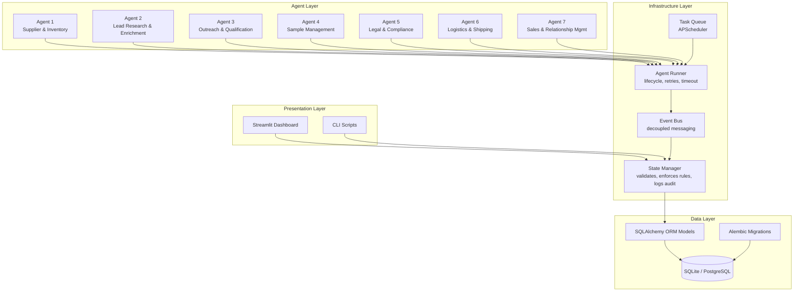
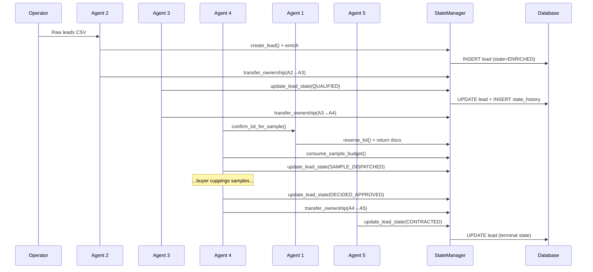

# Architecture Overview

## System Architecture



## Key Design Principles

### 1. Single Source of Truth

The database is the only source of truth. No agent writes files directly.
Every state mutation goes through the StateManager, which validates inputs,
enforces business rules, and logs to an append-only audit trail.

### 2. Layered Architecture

| Layer | Responsibility | Cannot |
|-------|---------------|--------|
| Presentation | User interface (dashboard, CLI) | Touch DB directly |
| Agent | Business logic, reasoning | Write files, bypass StateManager |
| Infrastructure | Lifecycle, messaging, scheduling | Contain business rules |
| Data | Persistence, schema, migrations | Contain business logic |

### 3. Event-Driven Communication

Agents don't call each other directly. They publish events to the EventBus
(e.g., `LEAD_QUALIFIED`, `SAMPLE_DISPATCHED`). Other agents subscribe to
events they care about. This decouples agents — Agent 4 doesn't need to
know that Agent 5 exists.

### 4. Reversible Schema Evolution

All schema changes go through Alembic migrations. Every migration has an
`upgrade()` and `downgrade()` function. The database can be rolled back
to any point in time. No manual `ALTER TABLE` statements.

### 5. Configuration via Environment

All settings (database URL, sample budget caps, timezone, log level) come
from environment variables loaded via `.env`. The same code runs in
development, staging, and production — only the env vars change.

## Data Flow: Lead to Contract



## Folder Structure

```
coffee_export/
├── coffee_export/          # Main package
│   ├── config.py           # Settings (env-var driven)
│   ├── database/           # SQLAlchemy models + schema
│   ├── state/              # StateManager (single write path)
│   ├── events/             # EventBus
│   ├── tasks/              # TaskQueue (APScheduler)
│   ├── agents/             # All 7 agents
│   ├── dashboard/          # Streamlit UI
│   └── utils/              # Logging, helpers
├── alembic/                # Database migrations
│   ├── env.py              # Wired to our config + models
│   └── versions/           # Migration scripts (one per change)
├── data/                   # Runtime data (gitignored)
│   ├── coffee_export.db    # SQLite database
│   ├── docs/               # Lot attachments (EUDR, cupping, certs)
│   └── logs/               # Application logs
├── docs/                   # This documentation
├── tests/                  # Test suite
└── scripts/                # Utility scripts
```

## Technology Choices

| Concern | Choice | Why |
|---------|--------|-----|
| Database | SQLite → PostgreSQL | SQLite for dev (zero config), Postgres for prod (one-line swap) |
| ORM | SQLAlchemy 2.0 | Industry standard, type-safe, async support |
| Migrations | Alembic | Official SQLAlchemy migration tool, reversible |
| Config | python-dotenv + dataclasses | Typed, env-var driven, no hardcoded paths |
| Logging | Rich + RotatingFileHandler | Pretty console + grep-friendly files |
| Scheduling | APScheduler | Lightweight, no external broker needed |
| Dashboard | Streamlit | Fast to build, Python-only, good for internal tools |
| Formatting | Black | Zero-config, opinionated, eliminates style debates |
| Linting | Ruff | 10x faster than flake8, replaces isort + pyupgrade |
| Pre-commit | pre-commit framework | Enforces quality before every commit |
