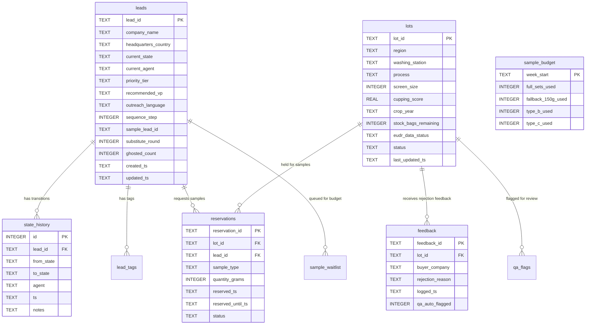
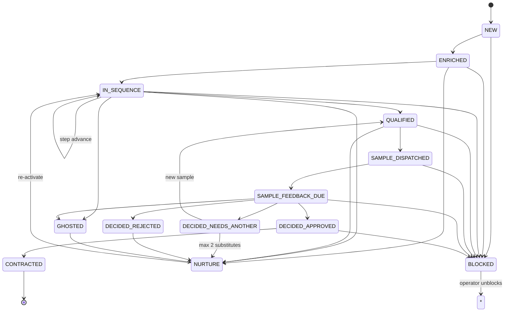

# Database Schema

## Overview

The database is the single source of truth. All agents read and write
through the StateManager, which validates inputs and enforces business
rules. Schema changes are managed by Alembic migrations — never manual
`ALTER TABLE` statements.

## Entity Relationship Diagram



## Tables

### `leads` — one row per buyer lead

The core entity. Every lead starts in `NEW` state and progresses through
the state machine (see below).

| Column | Type | Description |
|--------|------|-------------|
| `lead_id` | TEXT PK | Format: `L-YYYY-NNNNN` (e.g., `L-2026-00047`) |
| `company_name` | TEXT | Buyer company name |
| `headquarters_country` | TEXT | Country (for language + EUDR detection) |
| `source_row_hash` | TEXT | SHA1 of `company_name\|headquarters` for dedup |
| `current_state` | TEXT | Current state in the lifecycle (see state map) |
| `current_agent` | TEXT | Which agent currently owns this lead |
| `last_touch_ts` | TEXT | ISO 8601 timestamp of last activity |
| `next_action_due_ts` | TEXT | When the next action should happen |
| `next_action_agent` | TEXT | Which agent should take the next action |
| `priority_tier` | TEXT | `S` / `A` / `B` / `C` / `Disqualify` |
| `recommended_vp` | TEXT | `VP1` / `VP2` / `VP3` / `VP4` |
| `outreach_language` | TEXT | `EN` / `DE` / `FR` / `IT` / `JA` / `KO` / `ZH` / `AR` / `TR` / `RU` |
| `sequence_step` | INTEGER | Agent 3's outreach step (0–6) |
| `sample_lead_id` | TEXT | Agent 4's sample cycle ID |
| `substitute_round` | INTEGER | Agent 4's substitute count (max 2 per crop cycle) |
| `ghosted_count` | INTEGER | How many times this lead has ghosted |
| `created_ts` | TEXT | Lead creation timestamp |
| `updated_ts` | TEXT | Last update timestamp |

**Constraints:** `UNIQUE(company_name, headquarters_country)` — prevents duplicate leads.

---

### `state_history` — append-only audit trail

Every state transition is logged here. Never updated or deleted.

| Column | Type | Description |
|--------|------|-------------|
| `id` | INTEGER PK | Auto-increment |
| `lead_id` | TEXT FK → leads | Which lead transitioned |
| `from_state` | TEXT | Previous state (NULL for initial creation) |
| `to_state` | TEXT | New state |
| `agent` | TEXT | Which agent triggered the transition |
| `ts` | TEXT | ISO 8601 timestamp |
| `notes` | TEXT | Free-text context |

---

### `lead_tags` — free-form tags per lead

| Column | Type | Description |
|--------|------|-------------|
| `lead_id` | TEXT FK → leads | Tagged lead |
| `tag` | TEXT | Tag value (e.g., `fairtrade`, `organic`, `microlot`) |
| `tagged_ts` | TEXT | When the tag was added |

**PK:** `(lead_id, tag)` — a lead can have each tag only once.

---

### `lots` — one row per coffee lot

| Column | Type | Description |
|--------|------|-------------|
| `lot_id` | TEXT PK | Format: `LOT-YY-NNNN` (e.g., `LOT-25-0001`) |
| `region` | TEXT | `Yirgacheffe` / `Sidamo` / `Guji` / `Limu` / `Jimma` / `Harrar` / `other` |
| `washing_station` | TEXT | Station name |
| `coop_name` | TEXT | Cooperative name |
| `process` | TEXT | `Washed` / `Natural` / `Honey` / `Anaerobic` |
| `screen_size` | INTEGER | Screen size (e.g., 14 = screen 14+) |
| `cupping_score` | REAL | SCA cupping score (e.g., 86.5) |
| `q_grader_name` | TEXT | Q-grader who scored |
| `grading_date` | TEXT | ISO date |
| `defect_count_sca` | INTEGER | SCA defects per 300g |
| `moisture_pct` | REAL | Moisture percentage |
| `water_activity` | REAL | Water activity (if measured) |
| `crop_year` | TEXT | `YY/YY` format (e.g., `25/26`) |
| `harvest_date_range` | TEXT | Human-readable (e.g., `Nov 2025 – Jan 2026`) |
| `milling_date` | TEXT | ISO date |
| `stock_bags_remaining` | INTEGER | Bags in stock (60kg each by default) |
| `bag_size_kg` | INTEGER | Default 60 |
| `certifications` | TEXT | Semicolon-separated (`organic;FT;RA;4C`) |
| `certificate_of_origin` | TEXT | Ethiopian Coffee & Tea Authority cert # |
| `eudr_data_status` | TEXT | `complete` / `partial` / `missing` |
| `eudr_gps_lat` | REAL | Washing station latitude |
| `eudr_gps_lon` | REAL | Washing station longitude |
| `eudr_farmgate_price_etb_per_kg` | REAL | Price paid to farmer |
| `eudr_deforestation_attestation` | TEXT | Signed attestation path |
| `reserved_for_forward_program` | TEXT | `Yes` / `No` |
| `status` | TEXT | `active` / `committed` / `depleted` / `hold` |
| `last_updated_ts` | TEXT | ISO 8601 timestamp |

---

### `reservations` — 7-day sample holds on lots

| Column | Type | Description |
|--------|------|-------------|
| `reservation_id` | TEXT PK | Format: `RES-YYYYMMDDHHMMSS-LOTID` |
| `lot_id` | TEXT FK → lots | Reserved lot |
| `lead_id` | TEXT FK → leads | For which lead |
| `sample_type` | TEXT | `350g` / `200g` / `500g` / `150g` |
| `quantity_grams` | INTEGER | Sample weight |
| `reserved_ts` | TEXT | When reserved |
| `reserved_until_ts` | TEXT | 7 days after `reserved_ts` |
| `buyer_company` | TEXT | Buyer name |
| `crop_year` | TEXT | `25/26` or `26/27 representative` |
| `status` | TEXT | `active` / `expired` / `fulfilled` |

---

### `feedback` — rejection logs

| Column | Type | Description |
|--------|------|-------------|
| `feedback_id` | TEXT PK | Format: `FB-YYYYMMDDHHMMSS-MICRO-LOTID` |
| `lot_id` | TEXT FK → lots | Rejected lot |
| `buyer_company` | TEXT | Who rejected |
| `buyer_segment` | TEXT | Their segment |
| `rejection_reason` | TEXT | Verbatim reason |
| `logged_ts` | TEXT | When logged |
| `qa_auto_flagged` | INTEGER | 1 if this feedback triggered QA auto-flag |

---

### `qa_flags` — QA hold audit trail

| Column | Type | Description |
|--------|------|-------------|
| `qa_flag_id` | TEXT PK | Format: `QA-YYYYMMDDHHMMSS-LOTID` |
| `lot_id` | TEXT FK → lots | Flagged lot |
| `auto` | INTEGER | 1 = auto-flagged, 0 = manual |
| `reason` | TEXT | Why flagged |
| `flagged_ts` | TEXT | When flagged |

---

### `sample_budget` — weekly counter (one row per week)

| Column | Type | Description |
|--------|------|-------------|
| `week_start` | TEXT PK | ISO Monday date (e.g., `2026-06-29`) |
| `week_end` | TEXT | ISO Sunday date |
| `full_sets_used` | INTEGER | Type A sets used (cap: 3) |
| `fallback_150g_used` | INTEGER | Fallback samples used (cap: 2) |
| `type_b_used` | INTEGER | Type B forward samples used (cap: 2) |
| `type_c_used` | INTEGER | Type C post-contract (no cap) |
| `last_updated_ts` | TEXT | Last update |
| `last_updated_by` | TEXT | Agent or lead ID |

---

### `sample_waitlist` — leads queued for next week's budget

| Column | Type | Description |
|--------|------|-------------|
| `id` | INTEGER PK | Auto-increment |
| `lead_id` | TEXT FK → leads | Waiting lead |
| `tier` | TEXT | Priority tier (S processed first) |
| `sample_type` | TEXT | What type of sample they need |
| `queued_ts` | TEXT | When added to waitlist |
| `fulfilled_ts` | TEXT | When budget was allocated (NULL = still waiting) |

## State Machine

Leads transition through these states. Only allowed transitions are
accepted by the StateManager.



## Migrations

Schema changes are managed by Alembic. Each migration is a Python file in
`alembic/versions/` with an `upgrade()` and `downgrade()` function.

```bash
# Create a new migration (after changing SQLAlchemy models)
alembic revision --autogenerate -m "description of change"

# Apply all pending migrations
alembic upgrade head

# Roll back one migration
alembic downgrade -1

# Show current migration
alembic current

# Show migration history
alembic history
```

**Rules:**
1. Never edit a migration that's been committed and applied to production.
2. Always test both `upgrade` and `downgrade` locally before pushing.
3. One logical change per migration (don't bundle unrelated changes).
4. Migration filenames are auto-generated with a timestamp + slug.
